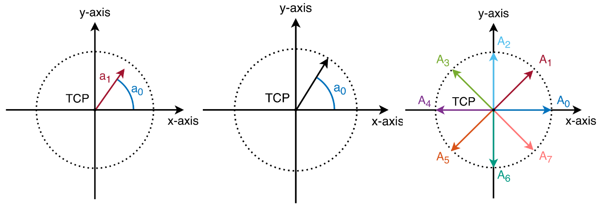
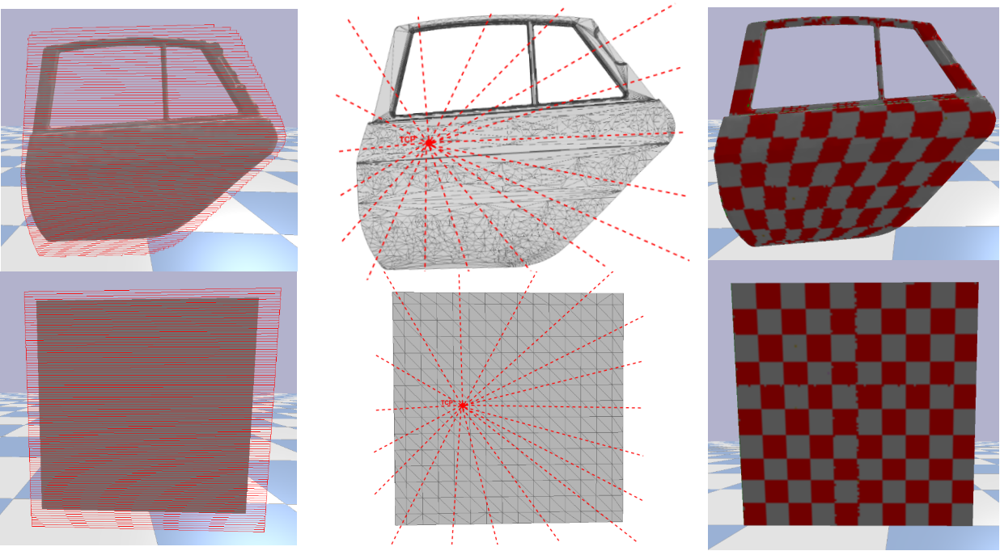
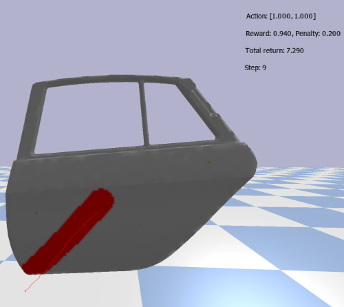

# PaintRL

This project implements the idea of PaintRL, the original paper can be found [here](https://sim2real.github.io/assets/papers/kiemel.pdf). The code of the simulation part can be found in the folder `PaintRLEnv`, while the RL training scripts are located in the main folder.

Two RL environments exists in the project, namely the `PaintGymEnv` for real paint simulation and the `ParamTestEnv` for the test of RL hyperparameters. Correspondingly, the training scripts in the main folder can be divided into two groups, which is differentiated by the first word of the file name: `paint_xxx.py` are training scripts that uses real mesh models, while the `param_test_xxx.py` scripts aim to test the hyperparamters for each RL algorithms.

Below is the introduction of the functions and variants in this project.

## Training and rollout

The RL training scripts are created by using the [Ray.RLlib](https://ray.readthedocs.io/en/latest/rllib.html) framework. Each script supports one specific training algorithm and can be divided into two modes: training mode and rollout mode. The script can be invoked via the command line interface.

**Training:** `python paint_xxx.py`.

The hyperparameters used in each training script can be found in the official document of the RLlib via this [link](https://ray.readthedocs.io/en/latest/rllib-algorithms.html).

**Rollout:** `python paint_xxx.py --mode=rollout --checkpoint=/path/to/the/checkpoint/file`

The maximum length of the rollout can be adjusted in the line `121` of the training script `paint_ppo.py`, the default value is `300`. i.e.,

```python
env['extra_config']['EPISODE_MAX_LENGTH'] = 300
```

## Parameters and variants in the PaintRL environment

The `PaintGymEnv` derives from the standard `Gym.Env`, therefore the class attributes follows the standard definition. Nevertheless, some augmented attributes exists to support the simulation and training task.

### Parameters in the constructor of the PaintGymEnv class

The adjustable parameters in the Env constructor can be roughly divided into two groups, one group charges for the rendering of the simulation process, another group changes for the adjustment of the RL training (reward shaping, part switch, etc).

To keep a slim interface of the constructor, some of the parameters are integrated into a dictionary named `extra_config`. The name and function of the parameters are illustrated in the following table.

| Parameter name | Default value| Comment|
| :---: | :---: |:----------------|
|urdf_root|No default value|path of the CAD mesh model used for training|
|with_robot|true|whether to show the robot and calculate the IK in the visualization|
|renders|false|whether to visualize the simulation or only calculates the simulation in the backend (saves resources, used in training process) |
|render_video|false|whether to render a video from current simulation|
|rollout|true|indicates if current simulation is a rollout|
|extra_config|PaintGymEnv.EXTRA_CONFIG|configurations in one dict to keep the interface slim|

And the `extra_config` contains the following parameters:

| Parameter name | Default value| Comment|
| :---: | :---: |:----------------|
|RENDER_HEIGHT|720|height of the video frame to be rendered|
|RENDER_WIDTH|960|width of the video frame to be rendered|
|Part_NO|0|number of the workpiece, default 0 is the door panel, 1 is the quadratic sheet, etc. The correspondent part dict can be found in `robot_gym_env.py` in line 108|
|Expected_Episode_Length|245|expected episode length, used to control the average reward need to be achieved in each step when the `TERMINATION_MODE` is  'early'|
|EPISODE_MAX_LENGTH|245|maximum allowed steps in one episode, if an episode reaches this sample step, current episode terminates|
|TERMINATION_MODE|'late'|mode of the termination, 'early', termination controlled by average reward, 'late', termination clipped by max permitted step, 'hybrid', termination is early at first, after reached threshold will switch to late mode|
|SWITCH_THRESHOLD|0.9|The switch threshold in hybrid mode|
|START_POINT_MODE|'anchor'|switch between different start point set, 'fixed' only one point, 'anchor' four anchor points, 'edge' edge points, 'all' all points, namely all of the triangle centers|
|TURNING_PENALTY|false|switch on the turning penalty|
|OVERLAP_PENALTY|false|switch on the overlap penalty|
|COLOR_MODE|'RGB'|use RGB color handler or HSI color handler|

### Adjusting the action and observation spaces

The action and observation space are defined in the `PaintGymEnv` class according to the abstraction of `Gym.Env`. As `Ray.RLlib` is used as the RL training framework, the action and observation space are directly used to build up the neural networks, changing the class attribute after the class specification via class method is not possible.

Therefore the action and observation spaces have to be adjusted inside the environment class definition in file `robot_gym_env.py`. The related class attributes are:

| Parameter name | Default value| Comment|
| :---: | :---: |:----------------|
|ACTION_SHAPE|1|dimensional of the action, can be 1 or 2 (only for continuous action space)|
|ACTION_MODE|'discrete'|mode can be 'discrete' or 'continuous'|
|DISCRETE_GRANULARITY|4|if in 'discrete mode, this attribute controls the fineness of the discretization'|
|OBS_MODE|'section'|mode of the observation, can be 'section', 'grid', 'simple' or 'discrete', the simple mode only have the relative TCP position, the discrete mode encodes the relative TCP coordinate to discrete values|
|OBS_GRAD|4|the granularity of the observation|

The design of the action space is shown in the following figure:



The design of the observation space is illustrated in the following figure:



### Change the paint tool profile

There are two changeable profile values of the paint tool, namely the radius of the paint shot and the step size of the paint tool per travelling step. Both are defined in the class `PaintToolProfile` in the file `bullet_paint_wrapper.py`.

### Adjust the paint shots per action and paint method

The paint shots per action is used to simulate the travelling speed of the tool, the following image shows the case with 6 shots. The default value is 5.


Two paint methods are available in the project:

1. paint, uses several paint beams to simulate the paint material, this method is able to handle surfaces with high curvature.
2. fast_paint, only one paint beam from the TCP center will be checked, the intersection point on the object surface is treated as the center of the paint shot. From this point, all texture points within the paint radius will be inquired to get all relative texture pixels. This method is slightly faster and have a stable performance on relative even surfaces.

The class attribute `Robot.PAINT_METHOD` in file `robot.py` is designed to switch paint method between these two.

### Threshold of the convex hull normal smoothness

The surface normal of the triangles in the mesh model are used to guide the tool TCP movement. However, the normal in some region are quite cluttered. To solve this problem, two normal smoothness approaches are introduced:

1. Convex hull normal smoothness. If the angle deviation between the triangle normal and the correspondent convex hull normal exceeds a certain threshold, this approach will be triggered. The threshold is controlled by the class attribute `ConvHull.CORRECT_THRESHOLD` in file `bullet_paint_wrapper.py`.
2. Normal smoothness with averaged neighbor normals, if the angle between current normal and the averaged normal is bigger than `pi / 18`, the normal will be smoothed.


## Auxiliary functions

### Processing the raw .obj file

The wavefront `.obj` file, which stores the mesh model of the workpiece, should be preprocess to have texture mapping information before use. This preprocessing is supported by the `process_script.py`, please make sure that Blender is installed before using it. The three arguments that should be passed to the script via command line interface are:

1. `--input-path`, path of the raw .obj file.
2. `--texture-path`, path of the texture image.
3. `--output-path`, path of the finished .obj file.

### Performance profiling

The performance profiling is designed to test the performance of the simulation environment. The `cProfile` module in python is employed to record the result. The profiling function and log display function can be found in file `zigzag.py`.

### Video rendering

The video rendering function is used to render a video from one simulation process. The function can be switched on by setting the `env['render_video']` in function `_make_env_config` in file `paint_ppo.py` to true, or by using the trajectory from the replay buffer with the following code in `robot_gym_env.py`:

```python
replay_buf = []
for a in replay_buf:
    env.step(a)
```

During the replay process please make sure the `render_video` in the constructor of the environment is set to true.

### Replay last trajectory

In rollout mode, each time after `env.reset()` is called, the stored actions in the replay buffer will be printed out in the terminal, which can be copied out and pasted in the `replay_buf` above and replayed several times.

Since in one rollout thousands of files may be generated, a directory under `/tmp/` with ten arbitrary alphabets as the folder name will be used as the path to store them. 

### Switch on the texture file capture function

Each time when the surface texture file is changed, the texture image can be stored to a location to support the simulation to real transfer. The texture file caption function can be switched on by the argument `capture_texture` in the constructor of the `Robot` class, which is in the `_load_environment` method in file `robot_gym_env.py`. 

### Change the text output of the diagnostic information

The text output in the simulation environment is used to display the diagnostic information in the GUI. The following image shows an example of this function:



The appearance of the text can be adjusted via the class attributes in the class `TextWriter` in file `PaintRLEnv/bullet_paint_wrapper.py`, including text size, color, etc.
